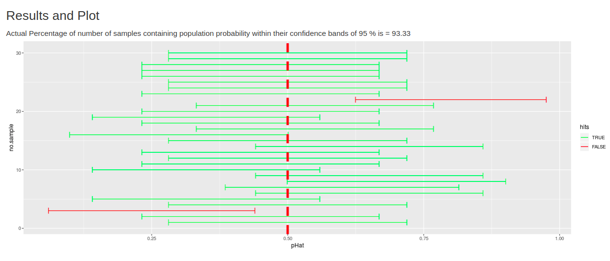

```{r setup, include=FALSE}
knitr::opts_chunk$set(echo=TRUE, message=F, warning=F, cache=F)
```

## What is the Assignment about

- This assignment is about Simulation of the confidence interval bands

- Example: In India, every year elections are held. It would be very
  handy to understand the population probability to vote for a
  candidate.
  
	  - In this case, we would take a sample and estimate from there with
	 95% confidence bands if the population probability lies within the
	 95% confidence bands.

- For this we need the Population Standard Deviation, which is usually
  not available.
  
- So we use the sample Standard error. 

- With this assignment simulation we try to see how good this
  estimation is

## Output



## Code

The code is available in this [github repository](https://github.com/agent18/c9-w4-coursera) which was made for
this course. The files are huge and hence there is not much point
showing them here.

There are two files:

- ui.R contains the user interface skeleton of the webpage
- server.R contains the backend and all calculations


## Sources


1. [Khan academny explanation of Confidence Intervals](https://www.khanacademy.org/math/ap-statistics/estimating-confidence-ap/introduction-confidence-intervals/v/confidence-interval-simulation)
2. [Inspiration for the assignment](https://www.khanacademy.org/computer-programming/confidence-intervals-about-a-proportion/6167177771548672)
